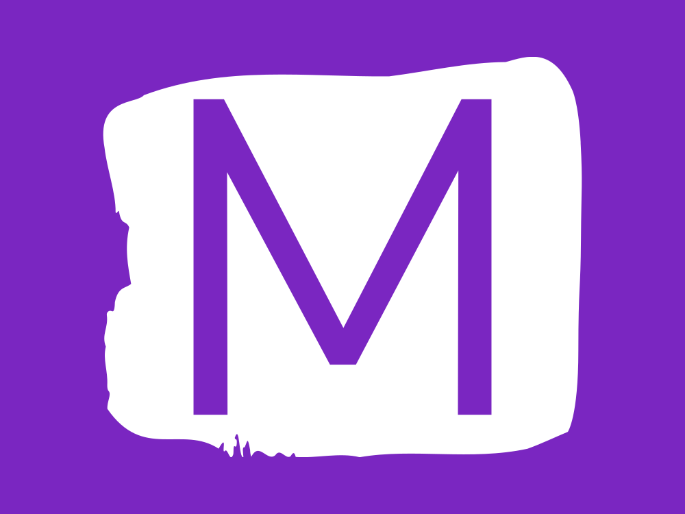

<a name="readme-top"></a>

[![Contributors][contributors-shield]][contributors-url]
[![Issues][issues-shield]][issues-url]
[![LinkedIn][linkedin-shield]][linkedin-url]


<!-- PROJECT LOGO -->
<br />
<div align="center">
  <a href="https://github.com/galveron/Musicly-project">
    
  </a>

  <h3 align="center">Musicly app</h3>

</div>

<!-- TABLE OF CONTENTS -->
<details>
  <summary>Table of Contents</summary>
  <ol>
    <li>
      <a href="#about-the-project">About The Project</a>
      <ul>
        <li><a href="#built-with">Built With</a></li>
      </ul>
    </li>
    <li>
      <a href="#getting-started">Getting Started</a>
      <ul>
        <li><a href="#prerequisites">Prerequisites</a></li>
        <li><a href="#installation">Installation</a></li>
      </ul>
    </li>
    <li><a href="#contact">Contact</a></li>
    <li><a href="#acknowledgments">Acknowledgments</a></li>
  </ol>
</details>


<!-- ABOUT THE PROJECT -->
## About The Project

[![Product Name Screen Shot][product-screenshot]]("images/musicly-screenshot.png")

Our project is an engaging Spotify-inspired application featuring a music player. Our goal is to give users the experience of music streaming and the a variety of features akin to the popular platform.
This project is exclusively intended for educational purposes, serving as a hands-on opportunity to gain proficiency in utilizing these tools effectively.

<p align="right">(<a href="#readme-top">back to top</a>)</p>


### Built With

* [![Express][Express.js]][Express-url]
* [![React][React.js]][React-url]
* [![Mongoose][Mongoose.com]][Mongoose-url]
* [![Bootstrap][Bootstrap.com]][Bootstrap-url]

<p align="right">(<a href="#readme-top">back to top</a>)</p>


<!-- GETTING STARTED -->
## Getting Started

To try out our application, please follow the next steps:

### Prerequisites

* npm
  ```sh
  npm install
  ```

### Installation

1. Clone the repo
   ```sh
   git clone https://github.com/galveron/Musicly-project
   ```
2. Change folder
   ```sh
   cd Musicly-project/server
   ```
3. Install NPM packages
   ```sh
   npm install
   ```
4. Run server
   ```sh
   npm start
   ```
5. Change folder
   ```sh
   cd ../client
   ```
6. Install NPM packages
   ```sh
   npm install
   ```
7. Run client
    ```sh
   npm run dev
   ```
8. Open app
   Enter http://localhost:5173/ in your browser.

<p align="right">(<a href="#readme-top">back to top</a>)</p>


<!-- CONTACT -->
## Contact

My profile on LinkedIn: [@veron-gal](www.linkedin.com/in/veron-gal)

Project Link: [https://github.com/galveron/Musicly-project](https://github.com/galveron/Musicly-project)

<p align="right">(<a href="#readme-top">back to top</a>)</p>


<!-- MARKDOWN LINKS & IMAGES -->
[contributors-shield]: https://img.shields.io/github/contributors/galveron/Musicly-project.svg?style=for-the-badge
[contributors-url]: https://github.com/galveron/Musicly-project/graphs/contributors
[issues-shield]: https://img.shields.io/github/issues/galveron/Musicly-project.svg?style=for-the-badge&colorB=FFC300
[issues-url]: https://github.com/galveron/Musicly-project/issues
[linkedin-shield]: https://img.shields.io/badge/-LinkedIn-black.svg?style=for-the-badge&logo=linkedin&colorB=0096FF
[linkedin-url]: https://linkedin.com/in/veron-gal
[product-screenshot]: images/musicly-screenshot.png
[Express.js]: https://img.shields.io/badge/express.js-000000?style=for-the-badge&logo=expressjs&logoColor=white
[Express-url]: https://expressjs.com/
[React.js]: https://img.shields.io/badge/React-20232A?style=for-the-badge&logo=react&logoColor=61DAFB
[React-url]: https://reactjs.org/
[Mongoose.com]: https://img.shields.io/badge/mongoose-8B0000?style=for-the-badge&logo=mongoose&logoColor=white
[Mongoose-url]: https://mongoosejs.com/
[Bootstrap.com]: https://img.shields.io/badge/Bootstrap-563D7C?style=for-the-badge&logo=bootstrap&logoColor=white
[Bootstrap-url]: https://getbootstrap.com
